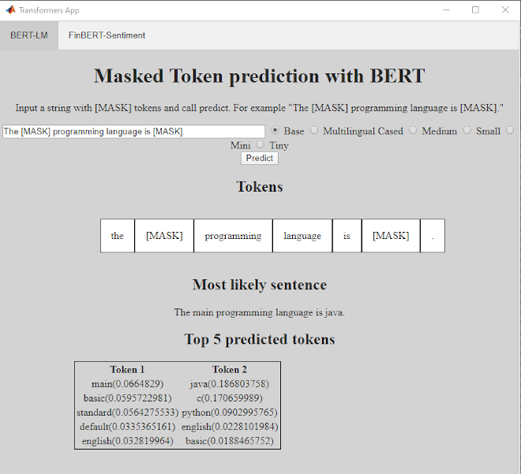

# Transformer Apps in MATLAB
In this repo I'm experimenting with apps using transformer models in MATLAB. This is partly motivated by the nice web app examples on [Hugging Face](https://huggingface.co/distilbert-base-uncased?text=The+goal+of+life+is+%5BMASK%5D.).

The app is based on [`uihtml`](https://www.mathworks.com/help/matlab/ref/uihtml.html). The html/css is pretty ugly - I haven't worked much on it.

## Dependencies
[Transformers](https://github.com/matlab-deep-learning/transformer-models) - needs to be on the path

## Setup
Call `setup.m` and instantiate the app with `transformer.app.App`.